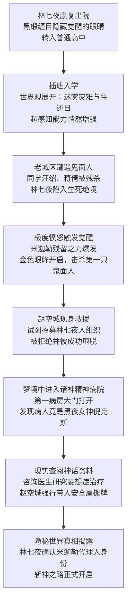

# 我在精神病院学斩神

> [!quote] 关于这本书
> 小说/文学类读书笔记，由 AI 生成分析。

---

## 核心主旨

《我在精神病院学斩神》是一部将都市异能与神话体系深度融合的幻想小说。故事以"觉醒"为核心命题——主角林七夜用十年的隐忍与伪装，在一个神明已然陨落、怪物肆虐人间的末世格局中，被迫踏入命运的轨道。

作者构建了一套精密的世界观：百年前的迷雾灾难将人类文明压缩至孤岛，而神话生物的真实存在彻底撕碎了现代理性的面纱。全书的独特之处在于以"精神病院"作为神圣与疯癫的双重隐喻——林七夜被关押的现实病院象征社会对"异见者"的规训，而梦中的诸神精神病院则颠覆这一逻辑：连神明也会心碎成疾，需要凡人去治愈。

写作风格兼具少年热血与克制的内敛气质。林七夜不是渴望战斗的英雄，而是一个理性、务实、珍视平凡生活的少年，他的力量觉醒源于对死亡的愤怒而非对荣耀的渴望。这种"反英雄化"的处理赋予人物真实的重量。情感底色是温暖的——姨妈家昏黄灯光下的晚饭，与血腥的超自然世界形成撕裂的对比，强化了林七夜"守护平静"的核心动机。

---

## 主要人物

| 姓名 | 身份/背景 | 性格特点 | 主要作用 |
|------|-----------|----------|----------|
| 林七夜 | 精神病院康复患者，炽天使米迦勒的代理人，高中插班生 | 理性务实、隐忍克制、独立自主，不为权力所诱惑 | 主角，故事驱动核心，连接凡人世界与神话世界的关键人物 |
| 赵空城 | 超自然组织成员，持淡蓝直刀的强力战士 | 干练帅气、擅长表演英雄气概，实则被林七夜的冷静屡屡挫败 | 引路人与推力，负责向林七夜揭示隐秘世界真相 |
| 倪克斯 | 古希腊神话黑夜女神，诸神精神病院第一病房患者 | 因精神创伤陷入严重妄想，将周围一切认作自己的孩子 | 林七夜首个"治疗目标"，象征神明的脆弱与创伤 |
| 杨晋 | 林七夜的表弟，同住家庭成员 | 关心表哥，代表温暖的日常生活 | 情感锚点，象征林七夜守护的平凡 |
| 李医生 | 精神科医生，负责林七夜的复查 | 遵循理性医学框架，无法理解超自然现实 | 揭示主角过去，象征现代理性体系的局限 |

---

## 故事结构

---

## 情节弧线

**第一阶段：伪装的平静（封面—第2章）**
林七夜以"盲人"身份重返社会，隐藏已恢复的视力与渐强的超感知能力。他渴望的只是普通高中生活，试图将十年的异常经历彻底封存，以伪装换取平静。

**第二阶段：被迫觉醒（第3章—第5章）**
老城区鬼面人袭击打碎了林七夜的退隐计划。目睹同学死亡、亲历死亡威胁，压抑十年的情绪在绝境中崩溃，炽天使米迦勒赐予的神圣之力以暴烈方式苏醒，命运轨迹就此不可逆转。

**第三阶段：主动选择（第6章—第9章）**
觉醒后的林七夜面对组织的拉拢保持清醒，以务实的判断多次拒绝赵空城。他回归家庭的温暖，选择独自承担秘密，同时在梦境中打开精神病院的大门，主动踏向命运为他准备的更深处。

**第四阶段：真相展开（第10章—第13章）**
两条线索同步推进：梦中，林七夜发现神明倪克斯因心理创伤而疯癫，承担起治愈神明的奇异使命；现实中，赵空城最终揭示隐秘世界体系，林七夜作为米迦勒代理人的真实身份与重量浮出水面。

---

## 金句摘录

> "每晚他都在梦境中做同样的梦——站在神秘的诸神精神病院前敲门，却始终无法打开。"

> "林七夜以'容易死'的务实理由拒绝，并在赵空城转身时悄然逃脱，消失在夜色中。"

> "外面是死亡与怪物的血腥，家里是亲情的简朴温馨。林七夜决定守护这份平静。"

> "连神明也会心碎成疾，而治愈她的人，是一个刚刚学会睁眼的少年。"

> "积累十年的被压抑情感在生死存亡瞬间爆发，触发了沉睡的力量觉醒。"

---

## 章节详情

### 封面

炎炎八月，一个用黑缎缠目的少年林七夜穿过繁忙的马路，拎着蔬菜和花生油，引起路人好奇。十年前他因目睹月球上的炽天使米迦勒而失明，受困于精神病院。如今虽已康复能视物，但仍需遮挡眼睛以避光。一个校服小女孩主动扶他过马路，林七夜表现稳定却显露出某种异常。他的真实身份与过往成谜，隐喻着他非寻常的命运。

### 内容简介

精神科医生李医生来院复查林七夜。少年坦诚讲述十年前看到月球上的炽天使、被其眼眸灼瞎的诡异经历，医生判定为精神病症状。林七夜随后推翻说法，声称只是摔跤脑震荡导致失明。然而在梦境中，月球炽天使的金色双眼形象深烙林七夜记忆。晚间与姨妈和表弟杨晋共餐时，林七夜隐瞒了眼睛已能视物的真相，准备转入普通高中，决心改变人生轨迹。

### 第1章 黑缎缠目

林七夜虽眼睛睁不开，却意外获得了"绝对视野"能力，能感知周身十米范围内一切，无视障碍物。过去五年中，这种能力逐渐增强。每晚他都在梦境中做同样的梦——站在神秘的诸神精神病院前敲门，却始终无法打开。梦境规则诡异，只能通过敲门这唯一方式尝试进入。这个循环暗示林七夜身上隐藏着更深层的超自然秘密，正在逐步苏醒。

### 第2章 月亮上的天使

林七夜以插班生身份进入沧南市第二中学。班级同学因姨妈的恳切拜托而热情照顾他，打破其孤立预期。课堂上，历史老师讲述百年前地球遭神秘迷雾吞噬，仅大夏幸存的设定。迷雾成分致命，无法穿透，过往探测队无一生还。3月9日被定为"生还日"纪念灾难日期。这段历史设定建立了故事的世界观，暗示人类文明危在旦夕，为后续超自然事件埋下伏笔。

### 第3章 敲门

林七夜与同学讨论迷雾与超自然现象。与此同时，一个男人用血液激活名为"无戒空域"的禁墟能力，用血痕在告示牌上划线，在老城区创造出隐形禁地。一支穿黑红斗篷的神秘队伍开始"鬼面人肃清行动"，队长独自追击逃脱的鬼面王。从地面上看不出异常，但老城区实则被强大的超自然力量笼罩。这一章引入禁墟系统，揭示超自然力量的存在和组织化管理。

### 第4章 生还日

李毅飞爆料老城区连续凶杀案，死者脸部被残忍剥去。林七夜一行人闻到恶臭后进入巷道，遭遇鬼面人怪物。鬼面人状似人形却具兽性，身体庞大、速度惊人、嗜血成性。它残忍地猎杀汪绍和蒋倩，将林七夜逼入绝境。林七夜面对死亡威胁，激荡的怒火与对生的渴望达到临界点，积累十年的被压抑情感在生死存亡瞬间爆发，触发了沉睡的力量觉醒。

### 第5章 无戒空域

在死亡边缘，林七夜的极端情绪激发了沉睡十年的双眼。他睁眼的刹那，炽天使米迦勒的残留力量猛烈爆发，璀璨金光冲天照亮半城。林七夜获得了金色眼眸、扩大的超感知范围和变态的动态视觉。他用新能力与导盲杖击杀第一只鬼面人。这是全书关键转折——林七夜从被动防守的牺牲者变为拥有神圣力量的能者，从压抑走向觉醒，命运轨迹根本改变。

### 第6章 鬼面人

远处超自然组织成员检测到米迦勒级别的神墟爆发，震惊于如此强大的力量突现沧南市。虽然力量爆发但体力耗尽的林七夜濒临被第二只鬼面人杀死。赵空城及时现身，用淡蓝直刀以压倒性实力轻易击杀怪物。赵空城试图说服林七夜加入超自然组织，但被直言拒绝。这一章展示了组织的存在与赵空城的个人风格，同时显露林七夜清醒的判断与独立意志。

### 第7章 我想活

赵空城击杀第二只鬼面人后，尝试用英雄气概和超能力诱惑林七夜加入组织。然而林七夜以"容易死"的务实理由拒绝，并在赵空城转身时悄然逃脱，消失在夜色中。赵空城感受到挫折——自己的精心表演对方视若无睹。这展现了林七夜理性自我的一面，他不为超能力迷惑，深知参与这种斗争的真实代价。

### 第8章 祂的眼

林七夜疲惫地回到家中。表弟杨晋询问他的情况和丢失的导盲杖，林七夜编造谎言隐瞒真相。他摘下黑缎露出蕴含金光的新眼眸，又重新缠上，用黑布掩盖觉醒的力量。与家人温暖的日常互动形成对比——外面是死亡与怪物的血腥，家里是亲情的简朴温馨。林七夜决定守护这份平静，暗示他将独自承担超自然世界的秘密与危险。

### 第9章 半截杖

林七夜经历了怪物、背叛和诡异觉醒后身心俱疲，决定不卷入隐秘事务。梦中他再次进入诸神精神病院，发现因睁眼后精神力增强，梦境身体变得凝实。他五年来坚持敲打的大门终于被打开，进入古老的精神病院。院内结构复杂，设有六个特殊病房，只有第一间能被打开。林七夜推开病房门，发现一位身着黑裙、气质神秘的女性，这一发现预示着他将踏入更深的秘密。

### 第10章 月下直刀

林七夜进入第一病房后，发现病人正是古希腊神话中的黑夜女神倪克斯。墙壁显示治疗任务：帮助倪克斯治疗精神疾病，可获得她的部分能力。倪克斯见到林七夜后激动异常，却错误地将花瓶、椅子等物认作自己的孩子，表现出严重的妄想症和幻觉症状。这位顶级神明因某种原因沦为精神病患者，暗示其背后有深刻的创伤。林七夜意识到帮助一位神明恢复理智的难度与责任。

### 第11章 开门

赵空城向同事汇报了与林七夜（炽天使代理人）的接触情况。特殊部队正追捕重伤后逃脱的怪物鬼面王，计划通过下水道埋伏。林七夜则去阳光精神病院寻找线索，又到图书馆查阅资料。赵空城整日守在校门口未获成功，傍晚在街道上终于追上林七夜。林七夜拔腿逃跑，但体力不支被赵空城锁住，两人就此在街上展开一场啼笑皆非的"追逐战"。

### 第12章 黑夜女神

林七夜以"朋友患精神病"为由咨询医生。他现场表演倪克斯的症状——将周围一切都认作孩子，医生诊断为重度妄想症，源于精神创伤导致的现实拒绝。医生建议药物与心理治疗结合，强调需从发病根源着手。林七夜意识到仅靠凡人医学无法治疗神明，需深入了解倪克斯的过去。他前往图书馆查阅神话资料，试图找到治疗突破口，同时赵空城在校门外的长期埋伏最终被破功。

### 第13章 他跑了

赵空城将林七夜强行带入情侣酒店的安全屋进行谈话。他向林七夜揭露隐秘世界的真相：100年前迷雾覆盖地球，人类开始观测到神话生物。001号是混沌之龙利维坦，003号是炽天使米迦勒。1928年米迦勒从月球发出金色剑芒摧毁火山，导致004号堕天使路西法被发现并封印。这一体系的建立象征着人类正式进入超自然时代，而林七夜作为米迦勒的代理人，身份的重要性远超预期。
